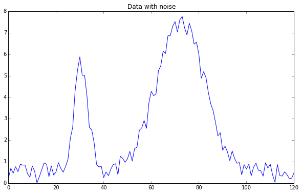
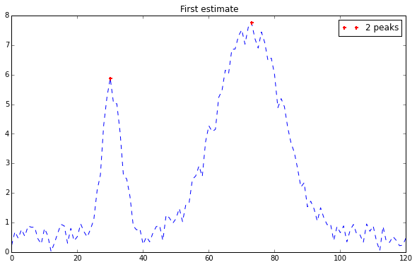
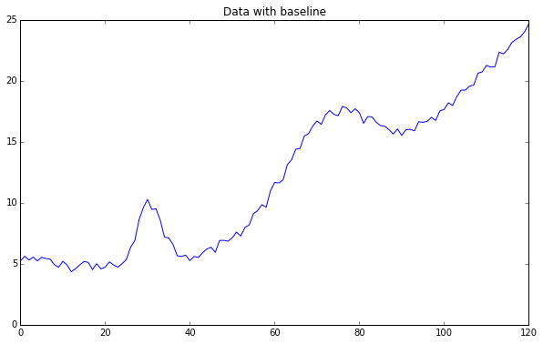
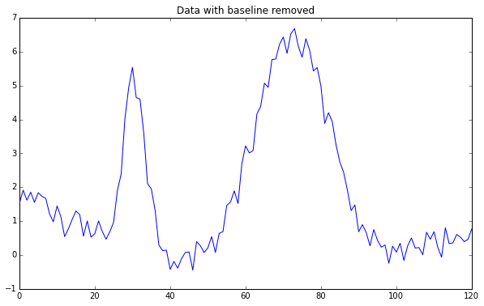

PeakUtils tutorial
==================

This tutorial shows the basic usage of PeakUtils to detect the peaks of
1D data.

Importing the libraries
-----------------------

.. code:: python

    import numpy
    import peakutils
    from peakutils.plot import plot as pplot
    from matplotlib import pyplot
    %matplotlib inline
    
Preparing the data
------------------

Lets generate some noisy data from two Gaussians:

.. code:: python

    centers = (30.5, 72.3)
    x = numpy.linspace(0, 120, 121)
    y = (peakutils.gaussian(x, 5, centers[0], 3) +
        peakutils.gaussian(x, 7, centers[1], 10) +
        numpy.random.rand(x.size))
    pyplot.figure(figsize=(10,6))
    pyplot.plot(x, y)
    pyplot.title("Data with noise")

Getting a first estimate of the peaks
-------------------------------------

By using peakutils.indexes, we can get the indexes of the peaks from the
data. Due to the noise, it will be just a rough approximation.

.. code:: python

    indexes = peakutils.indexes(y, thres=0.5, min_dist=30)
    print(indexes)
    print(x[indexes], y[indexes])
    pyplot.figure(figsize=(10,6))
    pplot(x, y, indexes)
    pyplot.title('First estimate')

.. parsed-literal::

    [31 74]
    [ 31.  74.] [ 5.67608909  7.79403394]

Enhancing the resolution by interpolation
-----------------------------------------

We can enhance the resolution by using interpolation. We will try to fit
a Gaussian near each previously detected peak.

.. code:: python

    peaks_x = peakutils.interpolate(x, y, ind=indexes)
    print(peaks_x)

.. parsed-literal::

    [ 30.58270223  72.34348214]

Estimating and removing the baseline
------------------------------------

It is common for data to have an undesired baseline.
*PeakUtils* implements a function for estimating the baseline by using
an iterative polynomial regression algorithm.

.. code:: python

    y2 = y + numpy.polyval([0.002,-0.08,5], x)
    pyplot.figure(figsize=(10,6))
    pyplot.plot(x, y2)
    pyplot.title("Data with baseline")

.. code:: python

    base = peakutils.baseline(y2, 2)
    pyplot.figure(figsize=(10,6))
    pyplot.plot(x, y2-base)
    pyplot.title("Data with baseline removed")

Related functionality in SciPy
------------------------------

SciPy also implements functions that can be used for peak detection.

Some examples:

-  `scipy.signal.find\_peaks\_cwt <http://docs.scipy.org/doc/scipy/reference/generated/scipy.signal.find_peaks_cwt.html>`__
-  `scipy.signal.savgol\_filter <http://docs.scipy.org/doc/scipy/reference/generated/scipy.signal.savgol_filter.html>`__

